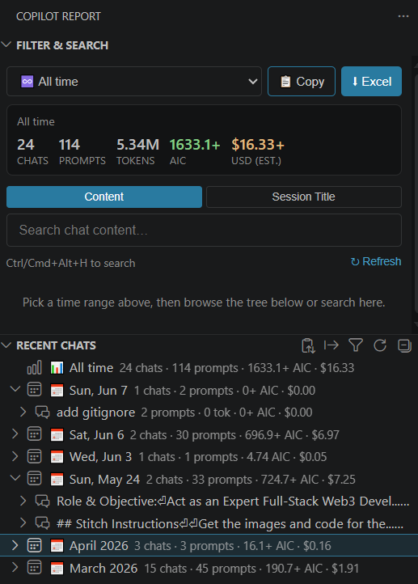

# Github Copilot Report

A VS Code extension that turns your **local GitHub Copilot chat history** into a usage report — showing the **tokens and AIC (AI Credits) used next to every prompt**, letting you **filter by the current week or month**, and **exporting a detailed Excel workbook**.

Everything runs **100% locally**. No data ever leaves your machine.

> Built on top of the excellent [copilot-chat-history-search](https://github.com/jeevananthamp16/copilot-chat-history-search) by @jeevananthamp16, extended with token/AIC accounting, time filters and Excel export.

---

## Screenshots

<p align="center">
  
</p>

_The sidebar: pick a time range, read the live **Chats · Prompts · Tokens · AIC · USD** totals, and browse **Recent Chats** where every prompt is annotated with its `token · AIC · $` usage._

---

## Features

- **Sidebar activity-bar view** with two panels:
  - **Filter & Search** (webview) — time-range dropdown, live totals, and content/title search.
  - **Recent Chats** (tree) — your chats grouped by day, each prompt annotated with its usage.
- **Token / AIC / USD per prompt.** Every user prompt shows a badge like `▲ 35k  ▼ 252  ·  10.9 AIC  ·  $0.11`:
  - `▲` input (prompt) tokens · `▼` output (completion) tokens · **AIC** · estimated **USD** cost.
- **Time filter.** Choose **This Week** (Mon–Sun) or **This Month** — *defaults to the current month*. There is also an **All time** option.
- **Excel export.** One click exports everything in the current filter to an `.xlsx` with a **Summary** sheet (totals, by-model, by-day) and a **Prompts** sheet (one row per prompt with tokens & AIC).
- **Copy to clipboard.** The **📋 Copy** button (left of Export) copies the filtered table as tab-separated text — paste it straight into Excel or Google Sheets.
- **Pick your columns.** On export you tick which fields to include. The necessary ones — *#, Session, Model, Prompt, AIC, USD (est.), Input/Output/Total Tokens, Date* — are pre-selected in that order; optional ones (Workspace, Response) are one click away. Your choice is remembered and shared by both Copy and Export. The **Summary** sheet also breaks USD down by model and by day, and prints the `1 AIC = $x` rate it used.

## What is "AIC"? And the USD estimate

GitHub Copilot's usage-based billing prices each model in **AICs (AI Credits) per 1,000,000 tokens**. For example Claude Sonnet 4.6 is recorded in the chat data as `In: 300 · Out: 1500 AICs/1M tokens`.

**AIC per prompt** is resolved in two ways, in this priority order:

1. **Actual (preferred).** If Copilot recorded the credits it actually billed for the request (a `nanoAiu` field in the request metadata), the extension uses it directly: `AIC = nanoAiu / 1e9`. This matches the number GitHub bills you, to the credit.
2. **Estimated (fallback).** Otherwise it reconstructs the AIC from tokens × the model's published rate:

   ```
   AIC = billableInputTokens/1e6 * inputCost
       + cachedTokens/1e6        * cacheCost
       + outputTokens/1e6        * outputCost
   ```

   (In the tree, a prompt's tooltip marks its AIC as `(actual)` or `(est.)` so you can tell which path was used.)

**USD estimate.** GitHub draws your budget down at a fixed rate of **1 AI credit = $0.01 USD** (a $10 budget = 1,000 credits — see [GitHub's usage‑based billing docs](https://docs.github.com/en/copilot/concepts/billing/usage-based-billing-for-individuals)). So every AIC figure is shown with a `$` estimate beside it:

```
USD = AIC × usdPerAic          (usdPerAic defaults to 0.01)
```

Model prices are read **directly from your chat data** when present, so new models are picked up automatically. You can override or add prices in settings (see below). When a model's price is unknown *and* no actual `nanoAiu` was recorded, its AIC/USD is shown as `—` and session/period totals are marked with a `+` (lower-bound).

> **How this compares to [ailmind/github-copilot-chat-usage](https://github.com/ailmind/github-copilot-chat-usage):** that project reads the billed `nanoAiu` credits straight from Copilot's logs (`AIC = nanoAiu / 1e9`) and cites the same `1 AIC = $0.01` rate. This extension now does the same when the data is present, and additionally falls back to a token × published‑rate estimate when it isn't — so you still get a number for older sessions that predate the `nanoAiu` field.

## How it reads your data

The extension parses the Copilot chat session files VS Code stores locally:

```
%APPDATA%\Code\User\workspaceStorage\<id>\chatSessions\*.jsonl   (Windows)
~/Library/Application Support/Code/User/...                       (macOS)
~/.config/Code/User/...                                           (Linux)
```

Each `.jsonl` is a delta log; the extension reconstructs each request and joins it with the
result metadata (`promptTokens`, `outputTokens`, `resolvedModel`) that Copilot writes for it.

Session titles are read from `state.vscdb` when the `sqlite3` CLI is available; otherwise the
first prompt is used as the title. **Token/AIC data does not depend on sqlite3** — it comes
straight from the `.jsonl` files.

## Settings

| Setting | Default | Description |
| --- | --- | --- |
| `githubCopilotReport.defaultFilter` | `month` | Time range applied on startup: `week`, `month`, or `all`. |
| `githubCopilotReport.storagePath` | `""` | Custom path to the VS Code `User` folder (for Insiders/portable). |
| `githubCopilotReport.maxResults` | `200` | Max search results. |
| `githubCopilotReport.fuzzyThreshold` | `0.4` | Fuzzy search threshold (0 = exact … 1 = anything). |
| `githubCopilotReport.modelPricing` | `{}` | Override/add AIC pricing, e.g. `{ "claude-sonnet-4.6": { "inputCost": 300, "outputCost": 1500, "cacheCost": 30 } }` (AIC per 1,000,000 tokens). |
| `githubCopilotReport.usdPerAic` | `0.01` | USD value of one AIC. Drives the `$` estimate shown next to every AIC figure. GitHub's rate is `1 AIC = $0.01`; change only if your plan differs. Takes effect after a **Refresh**. |

## Where the conversion-rate numbers live (what to edit)

These are the numbers that **decide** the tokens → AIC → USD math. If you ever need to correct or tune them, this is exactly where:

| What it controls | Change it at runtime (no rebuild) | Change the built-in default (code) |
| --- | --- | --- |
| **AIC → USD rate** (the money knob, `1 AIC = $0.01`) | Setting `githubCopilotReport.usdPerAic` | `DEFAULT_USD_PER_AIC` in [src/modelPricing.ts](src/modelPricing.ts) |
| **Per-model AIC rates** (input / output / cache per 1M tokens) | Setting `githubCopilotReport.modelPricing` | `DEFAULT_PRICING` in [src/modelPricing.ts](src/modelPricing.ts) — but note these are also auto-detected from your chat data |
| **AIC formula** (how tokens become AIC) | — | `computeAic()` in [src/modelPricing.ts](src/modelPricing.ts) |
| **Actual credits divisor** (`nanoAiu / 1e9`) | — | `NANO_AIU_PER_AIC` in [src/modelPricing.ts](src/modelPricing.ts) |
| **Actual-vs-estimate preference** (which `nanoAiu` fields are read) | — | `extractNanoAiu()` in [src/chatHistoryProvider.ts](src/chatHistoryProvider.ts) |

After changing a **setting**, click **↻ Refresh** in the panel to re-index with the new rate. After changing **code**, run `npm run compile` and reload the Extension Host.

## Usage

1. Open the **Copilot Report** icon in the activity bar.
2. Pick a time range in the dropdown (defaults to *This Month*).
3. Browse **Recent Chats**; expand a chat to see each prompt with its token/AIC badge.
4. Click the **⬇ Excel** button (or the export icon in the tree title bar) to save the report.

Keyboard: `Ctrl+Alt+H` (`Cmd+Alt+H` on macOS) to search.

## Development

```bash
npm install
npm run compile     # bundle to out/extension.js (esbuild)
npm run watch       # rebuild on change
```

Press `F5` in VS Code to launch an Extension Development Host.

## Acknowledgments

This extension stands on the shoulders of two great open-source projects — thank you 🙏 It combines and builds on ideas from both:

- **[copilot-chat-history-search](https://github.com/jeevananthamp16/copilot-chat-history-search)** by [@jeevananthamp16](https://github.com/jeevananthamp16) — the foundation for reading and searching VS Code's local Copilot chat session files.
- **[github-copilot-chat-usage](https://github.com/ailmind/github-copilot-chat-usage)** by [@ailmind](https://github.com/ailmind) — the reference for credit/cost accounting: reading the actual billed credits (`nanoAiu`) Copilot records and the `1 AIC = $0.01 USD` rate, which shaped this extension's AIC/USD math.

The chat-history search & parsing come from the first; the token → AIC → USD cost model is informed by the second. This project merges the two and adds time filters, per-prompt token/AIC/USD badges, and Excel export.

## License

MIT
