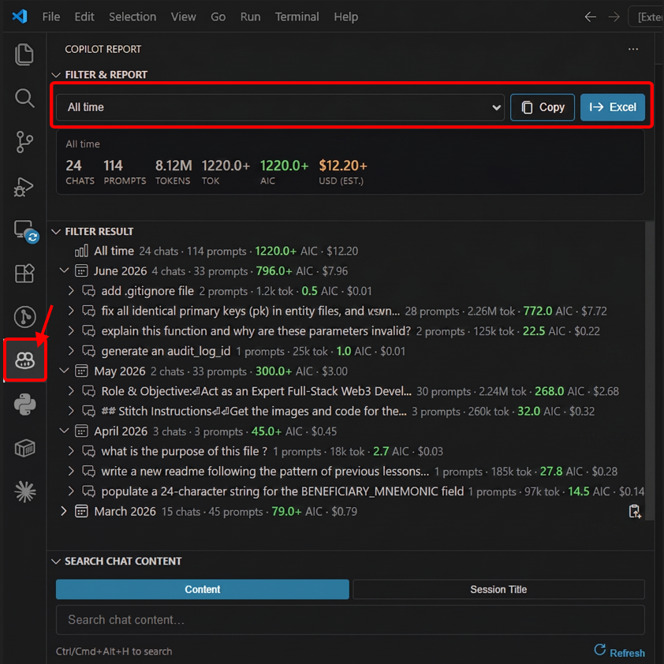
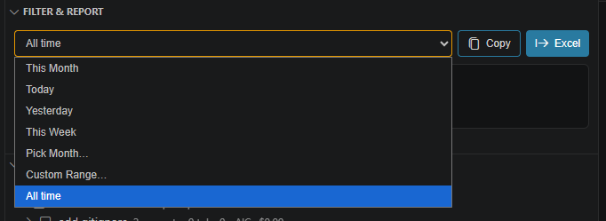
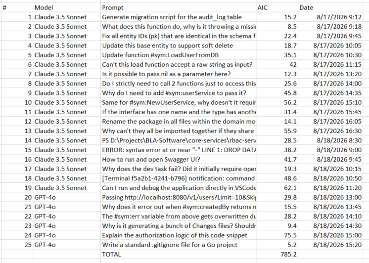

# Github Copilot Report

A VS Code extension that turns your **local GitHub Copilot chat history** into a usage report — showing the **tokens and AIC (AI Credits) used next to every prompt**, letting you **filter by the current week or month**, and **exporting a detailed Excel workbook**.

Everything runs **100% locally**. No data ever leaves your machine.

---

## 1. Introduction

**Github Copilot Report** is built to give you clear visibility into your Copilot usage. By default, GitHub Copilot Chat doesn't show how many AI Credits (AIC) are consumed per prompt or provide an easy way to export old chat history. 

This extension solves that by reading your local chat logs and presenting a clean, filterable interface with actual billed credits, making it easy to track your AI costs. It is built on top of the excellent [copilot-chat-history-search](https://github.com/jeevananthamp16/copilot-chat-history-search) by @jeevananthamp16 and [github-copilot-chat-usage](https://github.com/ailmind/github-copilot-chat-usage) by @ailmind.

---

## 2. Screenshots

### Sidebar & Filter Options
<p align="center">
  
  &nbsp;&nbsp;&nbsp;&nbsp;
  
</p>
<em>The sidebar (left): pick a time range, read the live **Chats · Prompts · Tokens · AIC · USD** totals, and browse **Recent Chats**. Filter Options (right): search or filter your usage easily. (Note: Add `filter_options.png` to `media/screenshots/`)</em>

### Excel Export
<p align="center">
  
</p>
<em>Export your filtered history to a detailed Excel file with Summary and Prompts sheets. (Note: Add this screenshot to `media/screenshots/export_excel.png`)</em>

---

## 3. Installation & Usage Guide

### Installation

**Option 1 — Install from the VS Code Marketplace:**
1. Open the **Extensions** panel (`Ctrl+Shift+X`).
2. Search for **"Github Copilot Report"**.
3. Click **Install**.

**Option 2 — Install from VSIX:**
Download the `.vsix` package from the repository and run:
```bash
code --install-extension github-copilot-report-1.x.x.vsix
```
*(Or in VS Code: **Extensions** panel → `...` menu → **Install from VSIX...**)*

### Usage

1. **Open the Extension**: Click the **Copilot Report** icon in the activity bar on the left.
2. **Filter & Search**: Pick a time range in the dropdown (defaults to *This Month*). You can also search for specific content or titles. Shortcut: `Ctrl+Alt+H` (`Cmd+Alt+H` on macOS).
3. **View Chats**: Browse **Recent Chats**. Expand any chat to see each prompt alongside a badge showing token counts, AIC, and USD estimate.
4. **Export**: 
   - Click the **⬇ Excel** button (or the export icon in the tree title bar) to save an `.xlsx` report.
   - Click the **📋 Copy** button to copy the table as tab-separated text and paste it into Google Sheets or Excel.
5. **Pick Export Columns**: On export, you can tick which fields to include. Your choice is saved for future exports.

---

## 4. Details & Features

### The Problem it Solves
GitHub Copilot Chat lacks clear visibility into:
- **Actual cost incurred**: Copilot bills usage-based plans in AIC, but there's no UI for credits per prompt.
- **Old chat history**: Scattered across `.jsonl` files per workspace.
- **Aggregate reporting**: Hard to roll up usage by week/month/model, or export for tracking.

### How it Works
This extension reads the Copilot chat session files VS Code stores locally:
- **Windows:** `%APPDATA%\Code\User\workspaceStorage\<id>\chatSessions\*.jsonl`
- **macOS:** `~/Library/Application Support/Code/User/...`
- **Linux:** `~/.config/Code/User/...`

It reconstructs each request and joins it with the result metadata (`promptTokens`, `outputTokens`, `resolvedModel`) that Copilot writes. Session titles are retrieved from `state.vscdb` (if `sqlite3` is available) or inferred from the first prompt.

### Token, AIC, and USD Calculation
GitHub charges usage-based plans in **AICs (AI Credits)**. This extension reports AIC straight from the actual billed credits, never from a guess!

**AIC per prompt** is read in this priority:
1. The `nanoAiu` field Copilot writes after billing: `AIC = nanoAiu / 1e9`.
2. The human-readable usage line in `result.details` (e.g., `"Raptor mini • 2.0 credits"`).

If neither is found, it shows `—` to avoid inaccurate guesses, and the total is marked with a `+` as a lower bound.

**USD estimate** uses GitHub's fixed rate:
`USD = AIC × usdPerAic` (defaults to `0.01`).

### Key Features
- **Sidebar view** with two panels: **Filter & Search** and **Recent Chats**.
- **Token / AIC / USD per prompt** badges (e.g., `▲ 35k  ▼ 252  ·  10.9 AIC  ·  $0.11`).
- **Time filters**: This Week, This Month, or All time.
- **Excel Export**: Detailed workbook with Summary (totals by model/day) and Prompts sheets.
- **Clipboard Copy**: Tab-separated copy for easy spreadsheet pasting.

---

## 5. Settings

You can customize the extension via VS Code settings:

| Setting | Default | Description |
| --- | --- | --- |
| `githubCopilotReport.defaultFilter` | `month` | Time range applied on startup (`week`, `month`, `all`). |
| `githubCopilotReport.storagePath` | `""` | Custom path to the VS Code `User` folder. |
| `githubCopilotReport.maxResults` | `200` | Max search results. |
| `githubCopilotReport.fuzzyThreshold` | `0.4` | Fuzzy search threshold (0 = exact … 1 = anything). |
| `githubCopilotReport.usdPerAic` | `0.01` | USD value of one AIC (`1 AIC = $0.01`). Update if your plan differs and **Refresh**. |

---

## 6. Development

```bash
npm install
npm run compile     # bundle to out/extension.js (esbuild)
npm run watch       # rebuild on change
```
Press `F5` in VS Code to launch an Extension Development Host.

---

## 7. Acknowledgments

This extension combines and builds on ideas from two great open-source projects:
- **[copilot-chat-history-search](https://github.com/jeevananthamp16/copilot-chat-history-search)** by [@jeevananthamp16](https://github.com/jeevananthamp16) — the foundation for reading and searching VS Code's local Copilot chat session files.
- **[github-copilot-chat-usage](https://github.com/ailmind/github-copilot-chat-usage)** by [@ailmind](https://github.com/ailmind) — the AIC/USD accounting model, credit extraction logic, and the `1 AIC = $0.01 USD` rate.

## License

MIT
